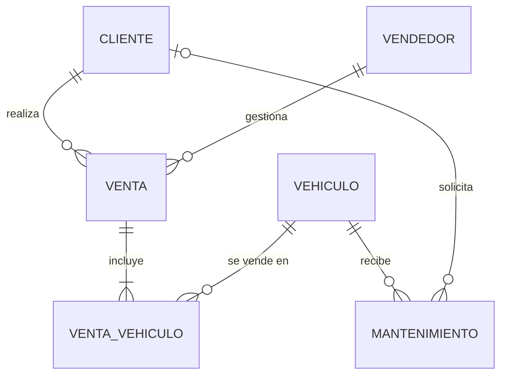

# Base de Datos — Concesionario de Vehículos

Diseño de base de datos relacional para la gestión de inventario de vehículos,
clientes, vendedores, ventas y mantenimiento de un concesionario.

## Contenido del repositorio

| Archivo | Descripción |
|---|---|
| `diagrama_er.mmd` | Diagrama Entidad-Relación en formato **Mermaid**. GitHub lo renderiza automáticamente al ver este archivo o al insertarlo en un `.md`. |
| `diagrama_er.dot` / `diagrama_er.svg` | Versión del diagrama en Graphviz (fuente `.dot` y salida vectorial `.svg`). |
| `diagrama_er.png` | Imagen del diagrama usada en la documentación. |
| `schema.sql` | Script DDL completo: tablas, claves primarias/foráneas, restricciones `CHECK`/`UNIQUE`, triggers de reglas de negocio (actualización automática de disponibilidad) y datos de ejemplo. Compatible con PostgreSQL. |
| `documentacion.pdf` | Documento con la justificación del diseño, diccionario de datos, relaciones UML y restricciones. |
| `documentacion.docx` | Versión editable de la documentación. |

## Ver el diagrama ER

Abre [`diagrama_er.mmd`](./diagrama_er.mmd) directamente en GitHub: se renderiza de forma nativa.
También puedes verlo pegando su contenido en <https://mermaid.live>.



## Resumen del modelo

- **CLIENTE** (1) — (N) **VENTA**
- **VENDEDOR** (1) — (N) **VENTA**
- **VENTA** (1) — (N) **VENTA_VEHICULO** (N) — (1) **VEHICULO**  → resuelve la relación N:M entre venta y vehículo
- **VEHICULO** (1) — (N) **MANTENIMIENTO**
- **CLIENTE** (0..1) — (N) **MANTENIMIENTO** (opcional)

Reglas de negocio clave implementadas con triggers en `schema.sql`:
- El VIN del vehículo es único (clave primaria).
- Al vender un vehículo (insertar en `venta_vehiculo`) su campo `disponible` cambia automáticamente a `FALSE`.
- No se puede vender dos veces el mismo vehículo (el trigger lanza una excepción).
- Si se anula una venta, el vehículo vuelve a estar `disponible`.

## Cómo probar el script

```bash
psql -U <usuario> -d <basededatos> -f schema.sql
```

Ver el detalle completo de justificación de diseño, diccionario de datos y restricciones en [`documentacion.pdf`](./documentacion.pdf).
